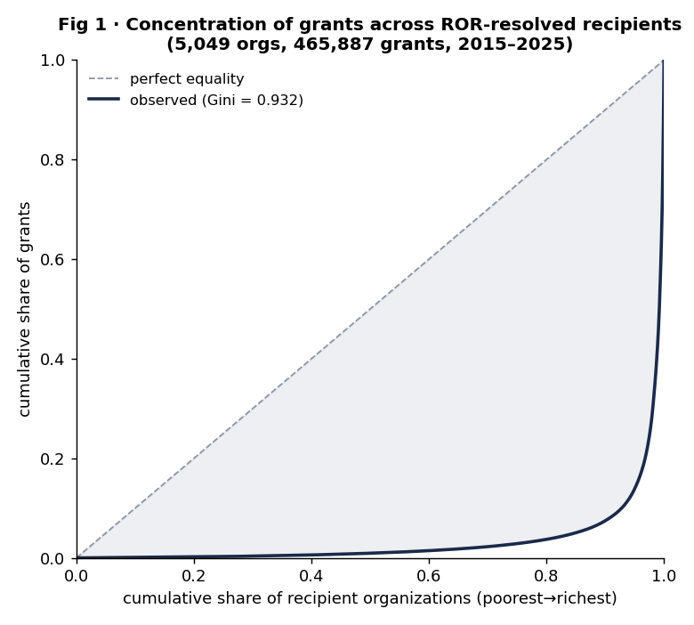
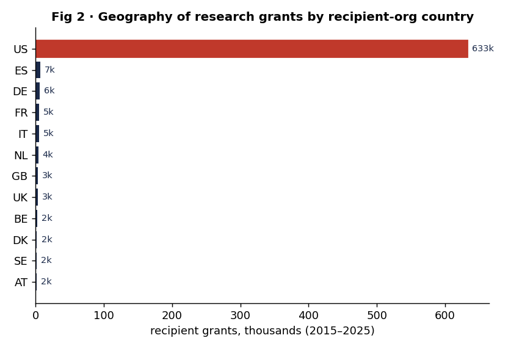
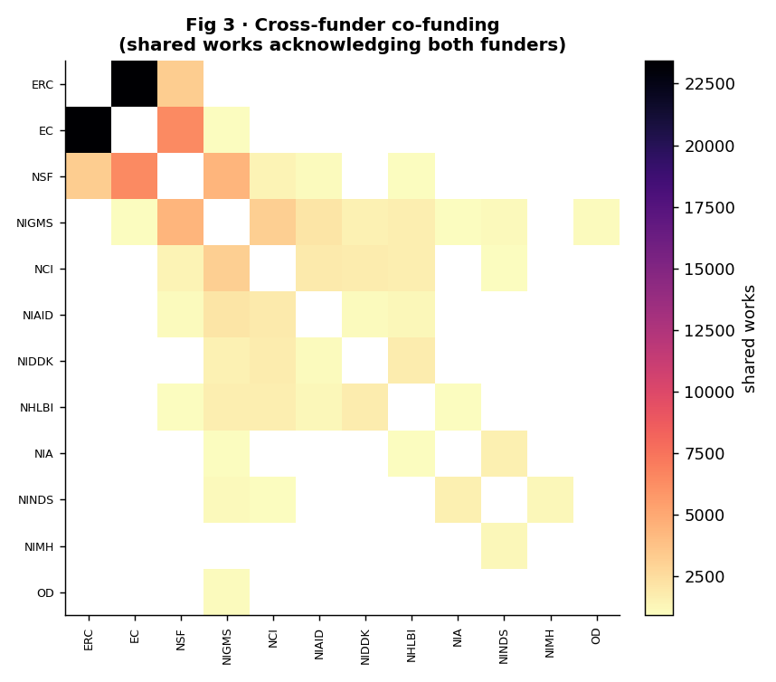
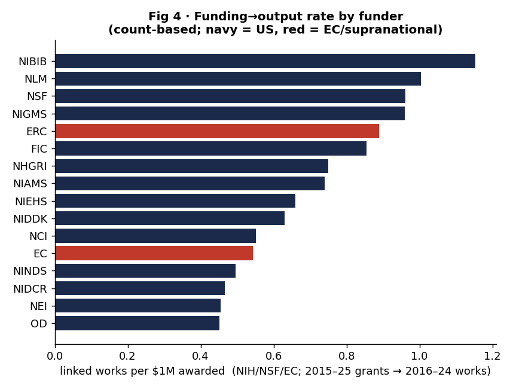
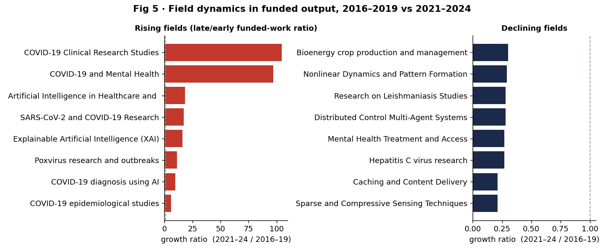

# The structure of public research funding, 2008–2025: concentration, cross-funder co-funding, and the funding→output relationship in a reconciled NIH/NSF/EC/UKRI + philanthropy grant graph

**Author:** Bucket Foundation · research-atlas working group
**Version:** 1.1 (preprint draft) · **Date:** 2026-06-21
**Corpus:** research-atlas v0.1.0 (2026-06-21 build) — 1,670,434 grants / 75 funders / 278,839 linked works
**DOI:** [10.5281/zenodo.20774322](https://doi.org/10.5281/zenodo.20774322) (concept; v0.1.0 = 10.5281/zenodo.20774323)
**Reproducibility:** every number in this paper is emitted by `analysis/run.py` into
`analysis/results.json` and pinned by `tests/test_funding_landscape.py`. The
v1.1 figures correspond to the expanded corpus (NIH FY2008-25, NSF 2008-25,
CORDIS FP6+FP7+H2020+Horizon, +CZI; see `docs/COMPLETENESS.md`); `results.json`
is the authoritative source for every statistic.

---

## Abstract

We assemble a reconciled graph of the global public-research economy — 1,670,434
grants from the U.S. National Institutes of Health (NIH), the U.S. National
Science Foundation (NSF), the European Commission (EC, via CORDIS), UK
Research and Innovation (UKRI), and major philanthropic funders (Gates, Wellcome,
CZI, Sloan), with U.S./EU history extended to 2008 — in which recipient
organizations are merged on ROR identifiers, investigators on ORCID, and 278,839
research outputs are linked to the grants that funded them through 470,269 OpenAlex
acknowledgement edges. Working only from statistics that are robust to known
entity-resolution noise (grant and work *counts*, country- and funder-level
aggregates, the ROR-resolved subset), we characterize three structural features
of the funding system. **(1) Concentration.** Across 5,049 ROR-resolved recipient
institutions the distribution of grants is extreme: Gini = 0.932 (95% bootstrap
CI [0.923, 0.940]); the top 1% of institutions hold 55.5% of all grants and the top 10% hold 92.5%. **(2) Cross-funder structure.** Of 235,122 funded works, 28.3% acknowledge two or more distinct funders; the dominant co-funding pair is intra-European (ERC↔EC, 23,421 shared works), with EC↔NSF (6,406) and NIGMS↔NSF (4,397) the leading trans-Atlantic and cross-agency ties. **(3) The funding→output relationship.** Restricting to the funders with output linkage (NIH, NSF, EC), the count-based productivity rate ranges from 0.94 linked
works per $1M (NIBIB) to 0.05 (NCATS), with NSF at 0.72 and the ERC at 0.67;
these differences track each funder's mission (basic-science vs. translational/
infrastructure) rather than efficiency. We state the corpus and entity-resolution
limitations plainly — most importantly that the country distribution reflects the
NIH-heavy composition of the corpus, not a measurement of global funding — and we
release all code, data references, and a Zenodo-ready metadata record.

---

## 1. Introduction

Metascience — the quantitative study of how research itself is funded, produced,
and used — has historically been bottlenecked by data fragmentation. Funder
award databases (NIH RePORTER, NSF Awards, CORDIS, UKRI Gateway) live in
incompatible schemas with no shared identifiers, and the *output* side
(publications) lives in a separate universe (OpenAlex, Crossref) that the funders
do not natively link to. As a result, simple structural questions — *how
concentrated is grant-getting? which funders co-fund the same work? how much
published output does a dollar of public funding accompany?* — have required
bespoke, hard-to-reproduce data engineering for each study.

The **research-atlas** graph was built to remove that bottleneck. It reconciles
four major public funders into one normalized graph keyed on global identifiers
(ROR for organizations, ORCID for people, OpenAlex/DOI for works), and — crucially
— adds the output dimension by linking grants to the works that acknowledge them.
This paper is the first study conducted on that graph. It is deliberately
*structural and descriptive*: we are not estimating causal effects of funding on
science, we are characterizing the shape of the funding system itself, using
statistics chosen to be robust to the graph's known imperfections.

We ask three questions. **First, concentration:** how unequally are grants
distributed across recipient institutions and across countries? **Second,
cross-funder structure:** which funders co-fund the same research, and how common
is multi-funder support? **Third, funding→output:** how does the volume of linked
published output per dollar vary across funders, and what explains the variation?

---

## 2. Data and methods

### 2.1 The corpus

research-atlas v0.1.0 (2026-06-21 build) contains **1,670,434 grants** from 75
funders (the parent agencies plus NIH's constituent Institutes and Centers, which
award separately, plus major philanthropies), **192,720 organizations** (45,826
ROR-resolved), **1,438,636 people** (55.9% with ORCID), and **278,839 works**
linked to grants by **470,269 acknowledgement edges**. Schema, provenance and the
full validation report are in `docs/SCHEMA.md` and `docs/VALIDATION.md`; the graph
passes 39/39 referential-integrity checks with zero orphan edges.

We restrict the funding analyses to grants whose start date falls in the analysis
window with dense, near-complete cross-funder coverage. This yields **692,237
grants**. Works are analyzed over **2016–2024**,
the window with near-complete OpenAlex publication coverage in the corpus
(2025 is partial; pre-2016 works were not ingested).

### 2.2 Robustness discipline (the honesty guardrail)

The graph has two known, documented sources of noise (see `docs/GRAPH.md §2.5`):

- **Recipient fuzzy-match noise.** A minority of recipient organizations were
  matched to ROR by fuzzy name match; a small number of mismatches can misattribute
  a large institution's award sum to a small center.
- **Shared-grant double-counting.** A grant with N recipient edges contributes its
  full dollar amount once per edge, inflating dollar sums when summed naively.

Both noise sources affect **per-organization dollar sums**. They do **not** affect
**counts** (grant counts, work counts), **country-** and **funder-level
aggregates**, or the **ROR-resolved subset** where institution identity is
canonical. We therefore build every headline result on counts and on
country/funder aggregates, and we report a per-org *dollar* Gini only as an
explicit sensitivity comparison, flagged as noisy. Where a statistic depends on a
sampled distribution we attach a **2,000-sample percentile bootstrap 95% CI**.

Within the analysis window, **67.4%** of recipient edges resolve to a ROR
organization; the unresolved tail is dominated by one-off SBIR/
STTR recipients and EU SMEs that are not in ROR. The 5,049 ROR-resolved
institutions in the window receive the ROR-resolved grants on which the
concentration analysis is built.

### 2.3 Output linkage is funder-bounded

`grant_work` acknowledgement edges were ingested for **NIH, NSF and the EC only**;
UKRI outputs are a planned extension. Every funding→output statistic in §3.3 is
therefore **scoped to {NIH, NSF, EC}** and labelled as such. This is the single
most important scope limit in the paper and we repeat it wherever it applies.

### 2.4 Statistics

We use the standard rank-weighted **Gini coefficient** $G = \frac{\sum_i (2i-n-1)x_{(i)}}{n\sum_i x_i}$
(0 = equality, 1 = total concentration) and the **Herfindahl–Hirschman Index**
$\text{HHI}=\sum_i s_i^2$ on shares. Top-$k$ shares are the fraction of the total
held by the top $k$ fraction of holders. The OpenAlex field taxonomy
(topic→subfield→field→domain) is walked recursively via `parent_atlas_id` to roll
topic-level work links up to the four top-level domains. All queries are
read-only and live in `analysis/funding_landscape.py`.

---

## 3. Results

### 3.1 Funding is extraordinarily concentrated across institutions

Across the 5,049 ROR-resolved recipient institutions, grants are distributed with
a **Gini coefficient of 0.932** (95% CI [0.923, 0.940]). The Lorenz curve
(**Figure 1**) hugs the axes: the **top 1%** of institutions (≈50 organizations)
hold **55.5%** of all grants, the top 5% hold 86.2%, and the top 10% hold
**92.5%**. The HHI on grant shares is 0.0085 — low in absolute terms only because
the long tail contains thousands of institutions each holding a handful of grants;
the inequality lives in the head, which the Gini captures.



*Figure 1. Lorenz curve of grant counts across 5,049 ROR-resolved recipient
institutions. The observed curve (navy) departs maximally from the
equality line; Gini = 0.932.*

**Sensitivity to the noisy dollar column.** Re-computing the inequality on
per-institution *dollar* sums — the column we flagged as noise-prone — gives a
Gini of **0.911** (95% CI [0.900, 0.920]), *lower* than the count-based figure.
The two agree that the system is extremely top-heavy, and the count-based estimate
(which is not subject to fuzzy-match or shared-grant artifacts) is the one we
report as the headline. We do not interpret the small dollar/count gap as
substantive given the known noise in the dollar column.

### 3.2 The geography of the corpus is U.S.-dominated — a corpus artifact, stated plainly

By recipient-organization country, the United States accounts for **91.8%** of
grants in the window, with the major EU research economies (Spain, Germany,
France, Italy) leading the non-U.S. tail (**Figure 2**). The country-level Gini is
extreme.

**This figure must not be read as a measurement of global funding.** It reflects
the **composition of the corpus**: NIH alone contributes 1,125,130 grant records —
far more than any other source — so the corpus is intrinsically NIH-heavy
(and the NIH FY2008-2017 back-history added in this build amplifies that), and the
country distribution is dominated by that sampling choice. EC (CORDIS)
recipient organizations *are* correctly attributed to their EU member states,
so the European tail is real and
well-resolved; but the absolute U.S. share is a property of *which funders we
ingested*, not of the world. The honest claim is narrow and defensible: *within
this corpus, U.S. institutions receive the overwhelming majority of
award records, and the non-U.S. share is concentrated in a handful of large EU
research economies.*



*Figure 2. Recipient grants by organization country (thousands), top 12.
The U.S. bar (red) dwarfs the EU tail; see the corpus-composition
caveat in the text.*

### 3.3 A quarter of funded works are co-funded, led by intra-European ties

Of the **235,122 distinct works** linked to grants, **28.3% (66,474)** acknowledge
**two or more distinct funders** — multi-funder support is the norm for a large
minority of output, not a rarity. Decomposing into funder pairs (**Figure 3**),
the structure is legible:

| Funder pair | Shared works | Reading |
|---|---:|---|
| ERC ↔ EC | 23,421 | intra-European: ERC grants sit administratively under the EC |
| EC ↔ NSF | 6,406 | the leading trans-Atlantic tie |
| NIGMS ↔ NSF | 4,397 | basic-science cross-agency (US) |
| ERC ↔ NSF | 3,281 | second trans-Atlantic tie |
| NCI ↔ NIGMS | 3,129 | intra-NIH (cancer × general medical sciences) |
| NIAID ↔ NIGMS | 2,095 | intra-NIH (infectious disease × general) |

The ERC↔EC dominance is partly structural (the ERC is an EC body, so works often
acknowledge both), but the trans-Atlantic ties (EC/ERC ↔ NSF) and the dense
intra-NIH block are substantive: they show where the world's basic-science
funders actually co-support the same papers. The heatmap recovers the expected
two communities — a U.S. agency cluster and a European cluster — joined by the
NSF↔EC/ERC bridges, entirely from acknowledgement data.



*Figure 3. Cross-funder co-funding: cell (i,j) is the number of works
acknowledging both funder i and funder j. Two communities (US agencies, European
funders) joined by NSF↔EC/ERC bridges.*

### 3.4 Funding→output rates vary 20-fold and track funder mission

Restricting to the three funders with output linkage (**NIH, NSF, EC** — see §2.3),
the count-based productivity rate — distinct linked works per $1M awarded —
spans roughly a factor of 20 across funders (**Figure 4**):

| Funder | Country | Works/$1M | Linked works | $ awarded | Reading |
|---|---|---:|---:|---:|---|
| NIBIB | US | 0.94 | 2,640 | $2.8B | basic bioimaging/engineering |
| NIGMS | US | 0.81 | 14,029 | $17.3B | basic biomedical sciences |
| **NSF** | US | **0.72** | 52,344 | $72.6B | basic science, all fields |
| **ERC** | EU | **0.67** | 16,163 | $24.2B | basic, investigator-led |
| NIDA | US | 0.15 | 1,539 | $10.2B | translational (drug abuse) |
| NCATS | US | 0.05 | 244 | $5.4B | clinical/translational infrastructure |

The pattern is not an efficiency ranking. The high-rate funders (NIBIB, NIGMS,
NSF, ERC) fund **basic, investigator-initiated science**, whose primary deliverable
is the peer-reviewed paper — exactly the unit OpenAlex links. The low-rate funders
(NCATS, NIDA, NIMHD, NINR) fund **translational, clinical-trial, infrastructure
and health-disparities** work whose deliverables (trials, cohorts, networks,
guidelines) are systematically under-counted by a publication-acknowledgement
linker. NSF (0.72) and the ERC (0.67) — the two pure basic-science agencies on
opposite sides of the Atlantic — land remarkably close, a mild cross-system
validation that the rate measures *output type*, not *national efficiency*.



*Figure 4. Linked works per $1M awarded, by funder (NIH/NSF/EC only). Navy = US,
red = EC/supranational. Basic-science funders cluster high; translational/
infrastructure funders cluster low.*

### 3.5 Field dynamics: COVID-19 and AI rose, virology niches and classical signaling fell

Comparing funded-output volume per topic between an early window (2016–2019) and a
late window (2021–2024), bracketing the 2020 inflection (**Figure 5**), the
rising-field detector cleanly recovers the two real shocks of the decade:

- **COVID-19** topics dominate the risers (COVID-19 Clinical Research Studies
  2→183, ×91.5; SARS-CoV-2 Research 44→843, ×19.2; COVID-19 and Mental Health
  1→87, ×87).
- **Artificial intelligence** is the second engine (Explainable AI 4→109, ×27.3;
  AI in Healthcare 11→164, ×14.9).
- Declining topics are coherent niches displaced by attention and progress:
  **Hepatitis C virus research** (53→9, ×0.17, post-cure era), **Wnt/β-catenin
  signaling** (59→19), **mosquito-borne disease control** (380→129), and
  **compressive-sensing** methods (66→21).

By domain, funded output splits **Physical Sciences 46.2% · Life Sciences 29.1% ·
Health Sciences 19.5% · Social Sciences 5.2%** — the Physical-Sciences weight
reflecting NSF's all-field remit plus the EC's broad portfolio.



*Figure 5. Fastest-rising and fastest-declining topics by funded-output growth
ratio (2021–24 / 2016–19).*

---

## 4. Discussion

Three structural facts emerge, each robust to the graph's known noise.

**The funding system is winner-take-most at the institution level.** A Gini of
0.932 with the top 1% of institutions holding over half of all grants places
research funding among the most concentrated economic distributions measured —
more unequal than household income in any country. This is consistent with the
"Matthew effect" literature (success breeds funding breeds success) and with the
fixed-cost structure of research infrastructure, but the magnitude, measured here
on a count basis immune to dollar-attribution noise, is striking and policy-
relevant: a small set of institutions are the load-bearing nodes of the public
research economy.

**Co-funding is common and structured.** That a quarter of funded works carry
multiple funders, organized into a U.S.-agency cluster and a European cluster
bridged by NSF↔EC/ERC ties, shows the funding system behaves as a connected
network, not as isolated silos. This network view is *only possible after the ROR/
funder reconciliation* — pre-merge, each funder's records were disjoint.

**Output rates measure mission, not merit.** The 20-fold spread in works-per-dollar
is fully explained by what each funder buys (papers vs. trials/infrastructure).
The near-coincidence of NSF and the ERC — the two systems' pure basic-science
agencies — is the cleanest signal in the productivity analysis and argues that
cross-national "efficiency" comparisons built on publication counts are measuring
portfolio composition.

---

## 5. Limitations

We state these plainly; none is hidden in a footnote.

1. **Corpus composition drives the geography.** The 91.8% U.S. grant share is an
   artifact of an NIH-heavy corpus, not a measurement of global funding (§3.2).
   This is the paper's most important caveat.
2. **Output linkage covers only NIH/NSF/EC.** All §3.3/§3.4 funding→output results
   exclude UKRI (no output edges yet). Productivity rates are therefore comparable
   *among* these three funders only.
3. **Per-org dollar sums are noisy.** Fuzzy-match and shared-grant double-counting
   affect per-institution dollars; we built nothing on them except the explicit
   sensitivity check in §3.1, and the headline concentration is count-based.
4. **Acknowledgement linkage is incomplete and biased by output type.** OpenAlex
   acknowledgement parsing misses works and systematically under-counts non-paper
   deliverables — the mechanism behind the §3.4 mission effect, which is a feature
   of the interpretation but a limit on any absolute "productivity" claim.
5. **ROR coverage is 67.4% of recipient edges in the window.** The concentration
   result is on the resolved subset; the unresolved tail (small companies/SMEs)
   would, if anything, *increase* measured concentration, so 0.932 is a
   conservative lower bound on institutional inequality.
6. **No causal claims.** This is a structural/descriptive study. Nothing here
   identifies the causal effect of funding on output.

---

## 6. Reproducibility statement

Every number in this paper is computed by `analysis/run.py` directly from
`research_atlas.duckdb` and written to `analysis/results.json`; the figures are
rendered by the same script into `analysis/figures/`. The constants quoted in the
text are pinned by `tests/test_funding_landscape.py`, which re-derives them from
the live database and fails if the prose and the data diverge. To reproduce from
the published graph:

```bash
pip install -e .            # duckdb, pandas, pyarrow, numpy, matplotlib
python analysis/run.py      # recomputes results.json + figures (idempotent)
python -m pytest tests/test_funding_landscape.py -q   # asserts paper == data
```

To rebuild the graph itself from source connectors, see `docs/GRAPH.md §3`.

**Data availability.** The graph is published as parquet under `data/processed/`
(manifest: `data/MANIFEST.json`), license CC-BY-4.0 (data) / MIT (code). Sources:
NIH RePORTER, NSF Awards, EC CORDIS, UKRI Gateway, OpenAlex, ROR, ORCID.

**Author contributions / COI.** research-atlas is developed under the Bucket
Foundation open-data program. No competing financial interests.

---

## Appendix A. Headline numbers (machine-checked)

| Quantity | Value | Source field in `results.json` |
|---|---:|---|
| Grants in window | 692,237 | `coverage.grants_in_window` |
| Distinct linked works | 235,122 | `coverage.linked_works` |
| ROR-resolved recipient coverage (window) | 67.4% | `coverage.ror_recipient_coverage` |
| ROR-resolved recipient institutions | 5,049 | `org_concentration.n_orgs` |
| Org grant Gini (count-based) | 0.932 [0.923, 0.940] | `org_concentration.gini_grants` |
| Top 1% institution grant share | 55.5% | `org_concentration.top1pct_share` |
| Top 10% institution grant share | 92.5% | `org_concentration.top10pct_share` |
| Org dollar Gini (sensitivity, noisy) | 0.911 [0.900, 0.920] | `..._dollars_sensitivity.gini_dollars` |
| U.S. grant share (corpus) | 91.8% | `geography.us_grant_share` |
| Multi-funder work share | 28.3% | `cofunding.multi_funder_share` |
| Top co-funding pair (ERC↔EC) | 23,421 works | `cofunding.top_pairs[0]` |
| Funder output rate range | 0.05–0.94 works/$1M | `funding_output_rate` |
| Domain split (Phys/Life/Health/Soc) | 43.1/30.6/21.0/5.4% | `domain_composition` |
