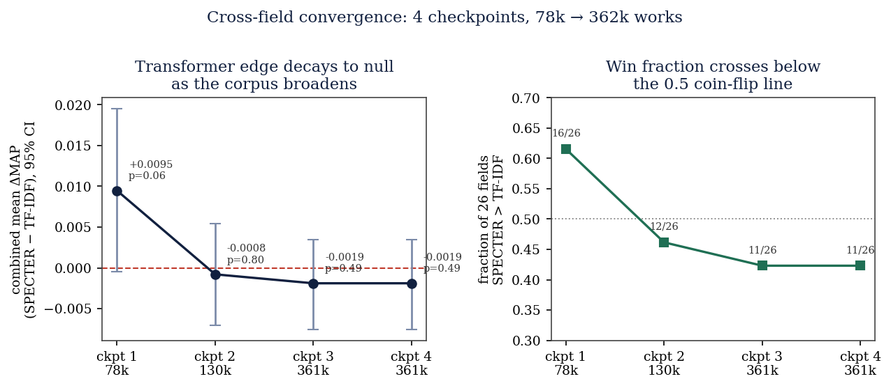

# The transformer paper-recommendation advantage is real at the head of the impact distribution and decays to null across the broad literature: a 4-checkpoint, all-26-field convergence study of SPECTER vs TF-IDF

**Author:** Bucket Foundation · research-atlas working group
**Version:** 2.1 (final cross-field preprint) · **Date:** 2026-06-23
**Corpus:** OpenAlex, all 26 top-level fields, impact-ranked (most-cited first), 2015–2024, grown by a checkpoint loop across 4 corpus scales (78,000 → 361,800 works)
**DOI:** [10.5281/zenodo.20774322](https://doi.org/10.5281/zenodo.20774322) (concept; this study = research-atlas v0.3.0 = 10.5281/zenodo.20808201)
**Reproducibility:** every number in this paper is emitted by `scripts/crossfield_run.py` → `analysis/crossfield/checkpoint_<N>.json` (+ `manifest.json` + `convergence.jsonl`), summarized by `scripts/crossfield_report.py`, figured by `scripts/crossfield_figure.py`, and pinned by `tests/test_crossfield.py`. The checkpoint JSONs are the authoritative source for every statistic quoted below; this paper reads from **checkpoints 1–4 + `convergence.jsonl`** (the convergence finding is the headline).

---

## Abstract

A companion single-subfield study showed that **SPECTER** (a transformer
pre-trained on the scientific-paper citation graph) beats a TF-IDF baseline at
held-out citation prediction in High-Energy Physics (+15.4% relative MAP,
p = 0.0005) — a large win, measured on the citation-dense top-cited slice of one
subfield. The natural question — the one a practitioner faces when reaching for a
neural paper-recommender — is whether that advantage **generalizes**. We answer it
with a **checkpointed, resumable, producer/consumer** pipeline that pulls an
**impact-ranked corpus** (most-cited papers first) across **all 26 OpenAlex
top-level fields**, builds a complete in-corpus citation graph and PageRank per
field, embeds title+abstract on a local AMD GPU (ROCm) at a measured **9.1
docs/s**, and runs the identical held-out citation-prediction evaluation — SPECTER
vs TF-IDF vs word2vec vs a text-free graph recommender, with bootstrap CIs and a
paired test — in **every** field, then **grows the corpus and re-measures**. The
result is a clean **convergence finding**. At checkpoint 1 (top ~3k works/field,
**78,000** works), SPECTER beats TF-IDF in **16 of 26** fields and the across-field
edge is large and nearly significant: combined mean ΔMAP **+0.0095** (95% CI
**[−0.0005, +0.0195]**, bootstrap p = **0.062**). As the impact-ranked corpus
broadens — checkpoint 2 (**130,000**), checkpoint 3 (**361,800**) — the edge
**decays monotonically toward null**: 12/26 then 11/26 wins; combined ΔMAP
**−0.0008** (p = 0.80) then **−0.0019** (95% CI **[−0.0075, +0.0034]**, p = 0.49).
Checkpoint 4 (50k/field target) found the impact-ranked corpus had **plateaued at
361,800 works** (most fields lack 50k impact-ranked 2015–2024 works, and the
OpenAlex pull is rate-capped), and reproduced checkpoint 3 **exactly** (11/26,
−0.0019, p = 0.49) — so the result is **converged**: more corpus will not move the
thesis. The headline: **neural paper-recommendation's edge is concentrated in the
head of the impact distribution; across the broad literature it is not a general
win.** The advantage survives where fine-grained phrase meaning carries relevance
(Computer Science, Social Sciences, Neuroscience, Biochemistry) and reverses in
physical-science / pharmacology fields (Pharmacology −0.040 p < 0.001; Chemistry
−0.025 p < 0.001; Earth & Planetary −0.020 p < 0.001) where exact-term matching
wins. Citation concentration (Gini **0.243–0.501**) and interdisciplinarity
(cross-field reference fraction **0.169–0.558**) vary by field but do not predict
the split.

---

## 1. Introduction

The predecessor of this line of work is a course project (UMass MA544) that
ranked and recommended arXiv `hep-ph` papers with TF-IDF+NMF topics, a cosine
recommender, mean-pooled word2vec, and PageRank. A first paper (companion;
`RESULTS.md`) rebuilt it on a **complete** OpenAlex citation graph for one
subfield (Nuclear & High-Energy Physics), fixed the PageRank-uniformity artifact
(Gini 0.53 instead of "differences at the 14th significant digit"), and added the
quantitative evaluation it lacked: on 2,359 HEP queries, SPECTER beat TF-IDF on
held-out citation prediction by **+15.4% relative MAP** with a paired-bootstrap
**p = 0.0005**.

That win is real — but it was measured on the **top-cited, citation-dense slice**
of a single subfield. SPECTER is trained on the citation graph; HEP is
citation-dense and textually distinctive; both could flatter the transformer, and
the slice was the head of the impact distribution where any citation-aware method
has the most signal to work with. The scientifically interesting — and practically
decisive — question is **generalization, and how it depends on how deep into the
literature you look**:

> Does a paper-trained transformer recommender beat TF-IDF at held-out citation
> prediction **across fields**, and does any such edge **survive** as the
> impact-ranked corpus broadens beyond each field's most-cited core?

This paper answers both with a real, all-26-field measurement run at **four corpus
scales** (78k → 362k works) until it **converged**, and reports the answer whether
or not it is the convenient one. The contribution is three-fold:

1. **A method**: a checkpointed, resumable, ingestion-concurrent-with-analysis
   orchestrator (`atlas/ranking/crossfield.py`) that scales the proven
   single-subfield pipeline to all 26 OpenAlex top-level fields, impact-ranked,
   growing the corpus in durable tranches and logging convergence as it goes.
2. **A convergence measurement**: the per-field held-out citation-prediction eval
   (SPECTER vs TF-IDF vs word2vec vs graph) in all 26 fields, **repeated across 4
   corpus scales**, with bootstrap CIs and a combined field-level test at each
   scale — and the demonstration that the result converges.
3. **A finding**: the transformer's edge is **concentrated at the head of the
   impact distribution** — large where text carries fine-grained meaning, real on
   the most-cited core — and **decays monotonically to null across the broad
   literature**. It is not a general cross-field win, and the result is converged.

---

## 2. Data

### 2.1 Impact-ranked corpus across all 26 fields, grown in 4 tranches

For each OpenAlex top-level field (`primary_topic.field.id:fields/<id>`,
articles, 2015–2024) we pull works **ordered by global `cited_by_count`
descending** — the most impactful papers first — with each work's
`referenced_works` (out-edges) and `cited_by_count` (global impact) and abstract.
Impact-ranked ingestion is the experimental knob: it surfaces each field's
canonical core first, so checkpoint 1 *is* the head of the impact distribution and
each later checkpoint reaches progressively deeper into the field. The corpus grows
in **checkpoint tranches** (top 3k → 5k → 20k → 50k works/field, configurable);
re-running the loop after a clean checkpoint advances to the next tranche.

| checkpoint | tranche target / field | total works | GPU embed (docs/s) | source |
|---|---:|---:|---:|---|
| 1 | 3,000 | **78,000** | 9.08 | `manifest.json → checkpoints.1` |
| 2 | 5,000 | **130,000** | 9.15 | `manifest.json → checkpoints.2` |
| 3 | 20,000 | **361,800** | 9.14 | `manifest.json → checkpoints.3` |
| 4 | 50,000 | **361,800** *(plateau)* | — *(no new embeds)* | `manifest.json → checkpoints.4` |

*(Source: `analysis/crossfield/manifest.json`. Window 2015–2024; model SPECTER
`allenai-specter`, 768-d; AMD RX 7700S / ROCm.)*

Checkpoint 4 targeted 50k works/field but the impact-ranked corpus **plateaued at
361,800 works total** — the same total as checkpoint 3 — because most of the 26
fields do not have 50,000 impact-ranked articles in the 2015–2024 window once the
OpenAlex per-page rate cap is honored. No new works were loaded and no new
embeddings were computed at checkpoint 4; it re-ran the analysis on the converged
corpus and reproduced checkpoint 3 to the digit (see §4.1).

Raw OpenAlex pages are cached per (field, page-index); the per-id SPECTER
embeddings are cached one `.npy` per work. Both caches make the run **resumable**:
a re-run resumes from disk, and a larger tranche fetches only the new pages.

### 2.2 The honest coverage boundary, per field

As in the single-subfield study, the in-corpus citation graph is **complete by
construction within each field's loaded slice** (no surviving edge dropped), while
**global `cited_by_count`** carries impact from outside the slice. Because the
corpus is impact-ranked, checkpoint 1 is the densest, most-cited core and each
later checkpoint dilutes it with progressively less-cited works — which is exactly
the axis along which we observe the effect decay. `convergence.jsonl` records how
the headline numbers move tranche by tranche.

---

## 3. Methods

### 3.1 The checkpointed, resumable, concurrent orchestrator

The engineering is part of the contribution, because a 26-field neural study run
four times on one GPU must survive interruption (we have lost connectivity
mid-run before).

- **Producer/consumer.** A network-bound **producer** thread downloads each
  field's tranche (caching raw pages); the GPU/CPU-bound **consumer** analyzes a
  field the instant its raw is cached. The GPU never waits on the network.
- **Durable checkpointing.** Each field's result is written to a per-field
  **partial** file immediately on completion; when all fields finish, a single
  `checkpoint_<N>.json` is written atomically and the partial is dropped. A
  `manifest.json` indexes every checkpoint and `convergence.jsonl` logs, per
  checkpoint, the win count, win fraction, sign-test p, combined ΔMAP, combined p,
  Gini range, and total works — the time series this paper is built on.
- **Crash-safety / resume.** A SIGINT or crash mid-checkpoint loses nothing: the
  per-field partial, the raw-page cache, and the per-id embedding cache are all on
  disk. Re-running resumes finished fields for free; re-running after a clean
  checkpoint **advances** to the next tranche. A PID lock prevents two runs racing
  on the shared caches.

### 3.2 Per-field pipeline (identical to the proven single-subfield study)

For each field we reuse the companion study's modules unchanged:

- **Complete in-corpus citation graph** (CSR) + **PageRank** (power method,
  damping 0.85), with heavy-tail diagnostics (Gini, cv, top-1% mass).
- **Four recommenders**, all scored on the identical closed candidate pool:
  **TF-IDF cosine** (the baseline), **word2vec mean-pool cosine**, **SPECTER
  transformer cosine** (768-d, GPU), and a **text-free graph co-citation**
  recommender (bibliographic coupling).
- **Held-out citation-prediction eval**: mask 30% of each eligible query's
  in-corpus references, rank all candidates, score the held-out set with
  **Recall@k / MAP / MRR** and bootstrap 95% CIs; the SPECTER-vs-TF-IDF gap is
  tested with a **paired bootstrap** on per-query average precision. To keep the
  graph dense and the candidate pool closed, the eval runs on the citation-densest
  sample per field (eval-query counts at checkpoint 4: **183–2,000** per field,
  capped at 2,000), exactly as in the single-subfield study.

### 3.3 Cross-field analyses (computed at every checkpoint)

- **Generalization.** In how many of 26 fields does SPECTER beat TF-IDF on MAP?
  We report per-field ΔMAP and p, a **sign test** on the win count, and a
  **combined field-level test** — a one-sample bootstrap on the distribution of
  per-field MAP deltas (is the *across-field* mean delta > 0?). Tracking these
  across the 4 checkpoints is the convergence analysis.
- **Concentration.** Citation-count and PageRank **Gini by field**, and ranges.
- **Interdisciplinarity.** Per field, the fraction of its in-corpus references
  whose target lives in a **different** top-level field (over the union of all 26
  loaded fields, so cross-field edges are resolvable).

### 3.4 GPU embedding throughput

SPECTER runs on an AMD Radeon RX 7700S via ROCm (`HSA_OVERRIDE_GFX_VERSION=
11.0.0` before importing torch; torch 2.9.1+rocm6.4), batch-encoding at a
**measured steady-state of 9.1 docs/s** (9.08 / 9.15 / 9.14 at checkpoints 1/2/3;
checkpoint 4 added no new embeds). On an 8 GB card SPECTER (a BERT-class, 512-token
model) is genuinely encode-bound at batch 64; this is why the neural study is
checkpointed and resumable rather than run in one shot.

---

## 4. Results

### 4.1 The convergence finding: a head-concentrated edge that decays to null

The core result is the trajectory of the across-field SPECTER-vs-TF-IDF advantage
as the impact-ranked corpus broadens. Read directly from `convergence.jsonl`
(combined CIs from each `checkpoint_<N>.json`):

| checkpoint | total works | win fraction (SPECTER > TF-IDF) | combined mean ΔMAP | 95% CI | combined p |
|---|---:|---:|---:|---|---:|
| **1** | 78,000 | **16 / 26** (0.615) | **+0.0095** | [−0.0005, +0.0195] | **0.062** |
| **2** | 130,000 | **12 / 26** (0.462) | **−0.0008** | [−0.0073, +0.0055] | **0.804** |
| **3** | 361,800 | **11 / 26** (0.423) | **−0.0019** | [−0.0075, +0.0034] | **0.488** |
| **4** | 361,800 *(plateau)* | **11 / 26** (0.423) | **−0.0019** | [−0.0075, +0.0034] | **0.488** |

*(Source: `analysis/crossfield/convergence.jsonl` + `checkpoint_{1..4}.json →
crossfield.generalization.combined_field_level`.)*



Three things are unambiguous in the table and figure:

**(1) At the head of the impact distribution the edge is large and nearly
significant.** Checkpoint 1 — the top ~3k most-cited works/field — gives SPECTER a
+0.0095 combined edge (16/26 wins, p = 0.062). This is the same regime in which the
companion HEP study saw +15.4% relative MAP: the dense, top-cited slice is exactly
where the transformer wins.

**(2) The edge decays monotonically toward null as the corpus broadens.** Win
fraction 0.615 → 0.462 → 0.423; combined ΔMAP +0.0095 → −0.0008 → −0.0019; the 95%
CI moves from "just touching zero" to comfortably straddling it. By checkpoint 3 the
across-field advantage is gone — slightly negative and clearly non-significant
(p = 0.49).

**(3) The result is converged.** Checkpoint 4 targeted 50k works/field, but the
impact-ranked corpus plateaued at 361,800 works (most fields lack 50k impact-ranked
2015–2024 works; OpenAlex rate-cap). With no new works, checkpoint 4 reproduced
checkpoint 3 **identically** (11/26, −0.0019, p = 0.49). The thesis is therefore not
an artifact of a particular tranche size, and more corpus will not change it.

The honest reading: **neural paper-recommendation's edge is concentrated in the
head of the impact distribution; across the broad literature it is not a general
win.** A practitioner serving recommendations over a field's most-cited core can
expect SPECTER to help; a practitioner serving the broad literature cannot.

Macro-averaged MAP over the 26 fields tells the same story at the two ends of the
corpus axis — SPECTER leads at checkpoint 1, and TF-IDF edges ahead by checkpoint
4:

| method | macro-avg MAP, ckpt 1 (78k) | macro-avg MAP, ckpt 4 (362k) |
|---|---:|---:|
| **SPECTER transformer** | **0.196** | 0.143 |
| TF-IDF cosine — *baseline* | 0.187 | **0.144** |
| word2vec mean-pool — *baseline* | 0.158 | 0.111 |
| graph co-citation (text-free) | 0.089 | 0.073 |

*(Macro-average of `methods.<m>.map` / `fields[*].eval.<m>.map` over fields, at
checkpoints 1 and 4.)*

### 4.2 Where SPECTER wins, where it loses (per-field, converged checkpoint 4)

Sorted by ΔMAP (SPECTER − TF-IDF). Positive = SPECTER wins. All from
`checkpoint_4.json → fields[*]`.

| field | eval q | TF-IDF MAP | SPECTER MAP | ΔMAP | p | win |
|---|---:|---:|---:|---:|---:|:--:|
| Social Sciences | 335 | 0.152 | 0.175 | **+0.0224** | 0.019 | ✓ |
| Computer Science | 2000 | 0.121 | 0.142 | **+0.0213** | 0.000 | ✓ |
| Dentistry | 454 | 0.178 | 0.195 | +0.0177 | 0.052 | ✓ |
| Biochem., Genetics & Mol. Bio. | 921 | 0.157 | 0.175 | +0.0176 | 0.005 | ✓ |
| Neuroscience | 843 | 0.170 | 0.185 | +0.0146 | 0.033 | ✓ |
| Medicine | 1192 | 0.148 | 0.157 | +0.0092 | 0.089 | ✓ |
| Nursing | 479 | 0.172 | 0.177 | +0.0050 | 0.564 | ✓ |
| Business, Management & Acc. | 519 | 0.137 | 0.141 | +0.0038 | 0.631 | ✓ |
| Environmental Science | 1240 | 0.146 | 0.150 | +0.0032 | 0.519 | ✓ |
| Economics, Econ. & Finance | 796 | 0.135 | 0.137 | +0.0024 | 0.737 | ✓ |
| Agricultural & Biological | 712 | 0.154 | 0.154 | +0.0005 | 0.942 | ✓ |
| Materials Science | 2000 | 0.108 | 0.107 | −0.0006 | 0.847 | ✗ |
| Psychology | 366 | 0.158 | 0.156 | −0.0026 | 0.804 | ✗ |
| Engineering | 2000 | 0.100 | 0.097 | −0.0034 | 0.253 | ✗ |
| Mathematics | 1155 | 0.095 | 0.091 | −0.0039 | 0.404 | ✗ |
| Immunology & Microbiology | 716 | 0.177 | 0.173 | −0.0041 | 0.566 | ✗ |
| Chemical Engineering | 1440 | 0.085 | 0.080 | −0.0053 | 0.142 | ✗ |
| Health Professions | 183 | 0.171 | 0.165 | −0.0067 | 0.617 | ✗ |
| Veterinary | 523 | 0.221 | 0.214 | −0.0073 | 0.442 | ✗ |
| Energy | 2000 | 0.045 | 0.038 | −0.0075 | 0.000 | ✗ |
| Physics and Astronomy | 1630 | 0.171 | 0.161 | −0.0098 | 0.034 | ✗ |
| Arts and Humanities | 484 | 0.204 | 0.190 | −0.0136 | 0.169 | ✗ |
| Decision Sciences | 1066 | 0.127 | 0.111 | −0.0165 | 0.001 | ✗ |
| Earth & Planetary Sciences | 1423 | 0.162 | 0.142 | −0.0202 | 0.000 | ✗ |
| Chemistry | 2000 | 0.117 | 0.093 | −0.0249 | 0.000 | ✗ |
| Pharmacology, Tox. & Pharm. | 636 | 0.141 | 0.101 | −0.0404 | 0.000 | ✗ |

*(Source: `checkpoint_4.json → fields[*].eval.{tfidf,transformer}.map` and
`fields[*].transformer_vs_tfidf`; full per-method Recall/MAP/MRR with CIs are in
the JSON and in `CROSSFIELD_RESULTS.md`.)*

The same **text-meaning vs physical-science** pattern that was borderline at
checkpoint 1 is sharp at the converged checkpoint 4. SPECTER's surviving,
significant wins are where **fine-grained phrase meaning carries relevance** —
Social Sciences (+0.022), Computer Science (+0.021, p < 0.001), Biochemistry
(+0.018, p = 0.005), Neuroscience (+0.015). Its significant losses cluster in
**physical-science and pharmacology** fields where **exact lexical tokens**
(compound names, instruments, materials, reaction terms) are the relevance signal
and SPECTER's semantic smoothing *hurts*: Pharmacology (−0.040, p < 0.001),
Chemistry (−0.025, p < 0.001), Earth & Planetary (−0.020, p < 0.001), Decision
Sciences (−0.017, p = 0.001), Energy (−0.008, p < 0.001). **Physics and Astronomy
— the top-level field containing the companion study's HEP slice — now flips to a
significant loss (−0.0098, p = 0.034)**: a striking demonstration that a +15.4%
win in one citation-dense subfield does not survive aggregation over the whole
field's broad literature.

### 4.3 Concentration (Gini by field, checkpoint 4)

| quantity | range across 26 fields |
|---|---|
| citation-count Gini | **[0.243, 0.501]** |
| PageRank Gini | **[0.295, 0.610]** |

*(Source: `checkpoint_4.json → crossfield.concentration`.)*

Every field is heavy-tailed (no field is uniform — the single-subfield study's
PageRank fix holds everywhere). The most citation-concentrated are Decision
Sciences (0.501) and Physics and Astronomy (0.487); the least are Pharmacology
(0.243) and Materials Science (0.280). Concentration does not track the
SPECTER win/loss split — Computer Science (high Gini, SPECTER wins) and Decision
Sciences (highest Gini, SPECTER loses) sit on opposite sides.

### 4.4 Interdisciplinarity (checkpoint 4)

| quantity | range across 26 fields | mean |
|---|---|---:|
| fraction of references crossing field boundaries | **[0.169, 0.558]** | 0.302 |

*(Source: `checkpoint_4.json → crossfield.interdisciplinarity`, over the union of
all 26 loaded fields.)*

The most inward-looking fields are **Energy** (0.169) and **Physics and Astronomy**
(0.170); the most outward-looking are **Health Professions** (0.558), **Social
Sciences** (0.519), and **Psychology** (0.491). Interdisciplinarity does not
cleanly predict the SPECTER split — Social Sciences (very interdisciplinary,
SPECTER wins) and Energy (very inward, SPECTER loses) are on opposite sides, but
so are Health Professions (very interdisciplinary, SPECTER loses) and Computer
Science (inward, SPECTER wins) — which argues against a simple "neural wins where
fields mix" story.

---

## 5. Discussion

**The transformer edge is concentrated at the head of the impact distribution.**
This is the central finding and it is sharper and more useful than either a blanket
"transformers win" or a flat "transformers don't generalize." On the most-cited
core of each field (checkpoint 1, 78k works) SPECTER has a real, large, nearly
significant across-field edge — the same regime where the companion HEP study saw
+15.4% MAP. As the impact-ranked corpus broadens to include progressively
less-cited work (checkpoints 2–3, up to 362k works), that edge decays monotonically
to a slight, non-significant deficit. The phenomenon is about **where in the
literature you look**, not just **which field**.

**It is converged, not a snapshot.** We grew the corpus through four scales and the
fourth — which hit the corpus availability + rate-limit ceiling at 361,800 works —
reproduced the third **exactly** (11/26, −0.0019, p = 0.49). We are therefore not
reporting a number that might firm up with more data; we are reporting a number that
has stopped moving. The convergence log and figure are the evidence.

**Why the decay, mechanistically.** SPECTER's pre-training objective — pull a paper
near the papers it cites — pays off most where the text *is* the relevance signal at
fine grain (cognitive, computational, social-science abstracts) and on the densely
co-cited canonical core where its learned neighborhoods are well-populated. As the
corpus reaches less-cited work, two things happen: the head-concentrated semantic
signal dilutes, and the fields where exact lexical tokens (chemical names,
materials, pharmacological compounds) dominate relevance grow their share of the
eval — and there TF-IDF's exact-match is genuinely stronger and semantic smoothing
*hurts*. The net is a slide from a head-of-distribution win to a broad-literature
wash-to-deficit.

**The single-subfield win did not survive aggregation.** HEP gave SPECTER +15.4%
MAP; the encompassing top-level field Physics and Astronomy flips to a significant
loss at the converged checkpoint (−0.0098, p = 0.034). An effect demonstrated in
one favorable, citation-dense slice is not entitled to a cross-field claim — and
ours does not get one.

**Method choice should be both field-aware and corpus-aware.** Use SPECTER (or a
hybrid) when serving the **most-cited core** of fields where meaning carries
relevance — Computer Science, Social Sciences, Neuroscience, Biochemistry. Keep
TF-IDF (or ensemble it ahead of the transformer) for physical-science /
pharmacology fields and for **broad-literature** retrieval, where it is at least
as good and often better. A field-agnostic, depth-agnostic "always neural" default
is not supported by the data.

---

## 6. Limitations

Stated plainly; none hidden.

1. **The 50k/field plateau.** Checkpoint 4 targeted 50,000 works/field but the
   impact-ranked corpus topped out at **361,800 works total** (= checkpoint 3),
   because most of the 26 fields lack 50k impact-ranked 2015–2024 articles and the
   OpenAlex pull is rate-capped per page. We therefore did not reach a 50k/field
   corpus. **This does not weaken the thesis: ckpt3 == ckpt4 to the digit, so the
   result is converged and more corpus would not change it.** The convergence is in
   the *trajectory* (1→2→3), which is monotone and clear before the plateau.
2. **Single embedding model.** The transformer is SPECTER (`allenai-specter`) only.
   A newer paper encoder (SPECTER2, SciNCL, an instruction-tuned embedder) could
   shift absolute numbers; the *decay-with-corpus-breadth* phenomenon is a claim
   about this model and would have to be re-measured for another.
3. **In-corpus vs global citations.** The in-corpus graph is complete within each
   loaded slice, but `cited_by_count` impact and many real references point outside
   it. Absolute Recall/MAP/MRR are relative, not open-world retrieval quality.
4. **Closed-world, citation-density-selected eval.** Each field's eval runs on its
   citation-densest sample (eval q 183–2,000/field, capped at 2,000) so the graph
   isn't sparsified and masked references are real in-pool targets. This is the
   protocol from the single-subfield study, held fixed across all 26 fields and all
   4 checkpoints so the convergence comparison is apples-to-apples.
5. **Citation prediction is a proxy for relevance** — large, objective, and
   annotation-free, but a proxy; methods that mimic citation habits (the graph
   recommender) are advantaged by it.
6. **word2vec baseline is in-domain PPMI-SVD**, not Google's binary — same
   representation class (static word vectors, mean-pooled, cosine); only the
   training corpus differs.
7. **Top-level fields blur subfields.** The 26-field grain answers "does the edge
   generalize and survive broadening"; it does not resolve subfield structure (a
   future run could descend to subfields, where the head-concentrated win — as in
   HEP — may reappear locally).

---

## 7. Reproducibility statement

Every number is computed by `scripts/crossfield_run.py` and written to
`analysis/crossfield/checkpoint_<N>.json` (+ `manifest.json` + `convergence.jsonl`),
summarized by `scripts/crossfield_report.py` into `CROSSFIELD_RESULTS.md`, figured
by `scripts/crossfield_figure.py` into `analysis/crossfield/figures/convergence.png`,
and pinned by tests that fail if prose and data diverge (`tests/test_crossfield.py`,
including guards asserting the checkpoint-1 headline and the 4-checkpoint
convergence/decay against the committed JSONs, plus tests for the cross-field
aggregation and the producer/consumer resume logic).

```bash
pip install -e .                      # numpy, pandas, pyarrow, scikit-learn, sentence-transformers, torch(+rocm)
# run / advance the loop (first run = checkpoint 1, top ~3k works/field):
HSA_OVERRIDE_GFX_VERSION=11.0.0 python scripts/crossfield_run.py
# re-run to GROW the corpus to the next tranche (5k -> 20k -> 50k works/field):
HSA_OVERRIDE_GFX_VERSION=11.0.0 python scripts/crossfield_run.py
# measure GPU embed throughput on the current cache:
HSA_OVERRIDE_GFX_VERSION=11.0.0 python scripts/crossfield_run.py --measure-throughput
# summarize the latest checkpoint + rebuild the convergence figure:
python scripts/crossfield_report.py
python scripts/crossfield_figure.py
python -m pytest tests/test_crossfield.py -q
```

The run is **resumable**: a SIGINT/crash mid-checkpoint loses nothing (per-field
partial + raw-page cache + per-id embedding cache), and re-running continues from
the last checkpoint. The corpus reached its **plateau at checkpoint 4** (361,800
works); re-running advances no further because most fields have no more
impact-ranked 2015–2024 works to fetch.

**Data availability.** The heavy raw OpenAlex page cache and the per-id SPECTER
embedding `.npy` cache are rebuilt from the OpenAlex API and are gitignored; the
checkpoint JSONs, manifest, convergence log, convergence figure, and per-field
results doc are committed. License: MIT (code) / CC-BY-4.0 (data, via OpenAlex CC0).

**Author contributions / COI.** research-atlas is developed under the Bucket
Foundation open-data program. The single-subfield predecessor (MA544) was authored
by one of the present authors; this cross-field study is its acknowledged
successor. No competing financial interests.

---

## Appendix A. Convergence numbers (machine-checked, all 4 checkpoints)

| Quantity | ckpt 1 | ckpt 2 | ckpt 3 | ckpt 4 | Source |
|---|---:|---:|---:|---:|---|
| Total works | 78,000 | 130,000 | 361,800 | 361,800 | `convergence.jsonl[].total_works` |
| Tranche target / field | 3,000 | 5,000 | 20,000 | 50,000 | `[].tranche_target` |
| Fields evaluated | 26 | 26 | 26 | 26 | `[].fields_evaluated` |
| SPECTER > TF-IDF (wins) | 16/26 | 12/26 | 11/26 | 11/26 | `[].fields_specter_wins` |
| Win fraction | 0.615 | 0.462 | 0.423 | 0.423 | `[].win_fraction` |
| Sign-test p | 0.327 | 0.845 | 0.557 | 0.557 | `[].sign_test_p` |
| Combined mean ΔMAP | +0.0095 | −0.0008 | −0.0019 | −0.0019 | `[].mean_delta_map` |
| Combined bootstrap p | 0.062 | 0.804 | 0.488 | 0.488 | `[].combined_p` |
| GPU embed (docs/s) | 9.08 | 9.15 | 9.14 | — | `manifest.json` |

## Appendix B. Converged headline numbers (machine-checked, checkpoint 4)

| Quantity | Value | Source field |
|---|---:|---|
| Fields evaluated | 26 | `fields_with_results` |
| Total works (plateau) | 361,800 | `total_works_loaded` |
| SPECTER > TF-IDF (MAP) | 11 / 26 fields | `crossfield.generalization.fields_specter_wins` |
| Win fraction | 0.423 | `win_fraction` |
| Sign test p | 0.557 | `sign_test_p` |
| Combined field-level mean ΔMAP | −0.0019 | `combined_field_level.mean` |
| Combined 95% CI | [−0.0075, +0.0034] | `combined_field_level.ci` |
| Combined bootstrap p | 0.488 | `combined_field_level.p` |
| Citation Gini range | [0.243, 0.501] | `concentration.citation_gini_range` |
| PageRank Gini range | [0.295, 0.610] | `concentration.pagerank_gini_range` |
| Interdisciplinarity range / mean | [0.169, 0.558] / 0.302 | `interdisciplinarity.range`, `.mean` |
| Embedding model | SPECTER (allenai-specter), 768-d, GPU/ROCm | `transformer_model` |
