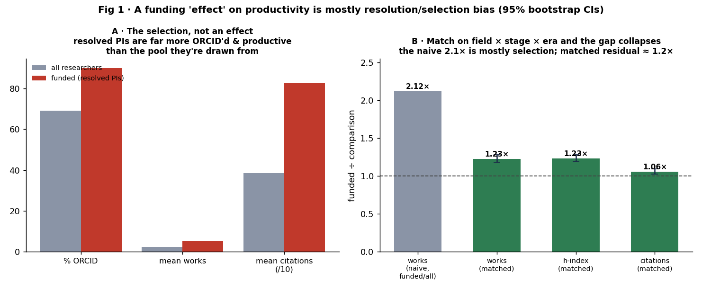
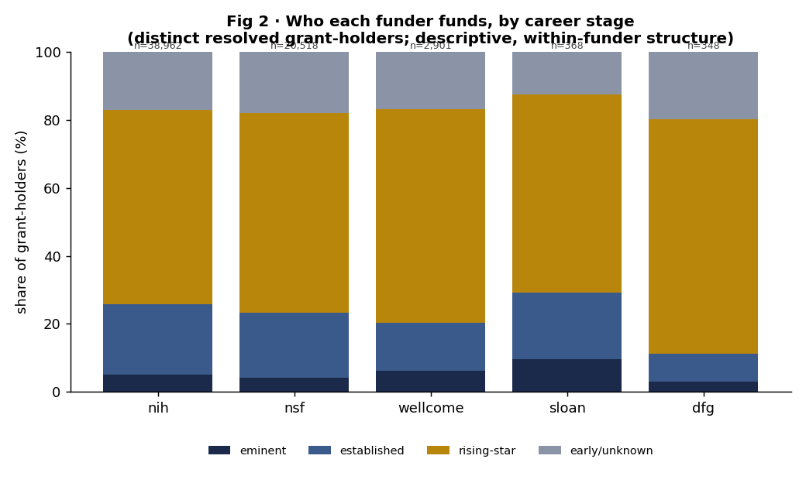
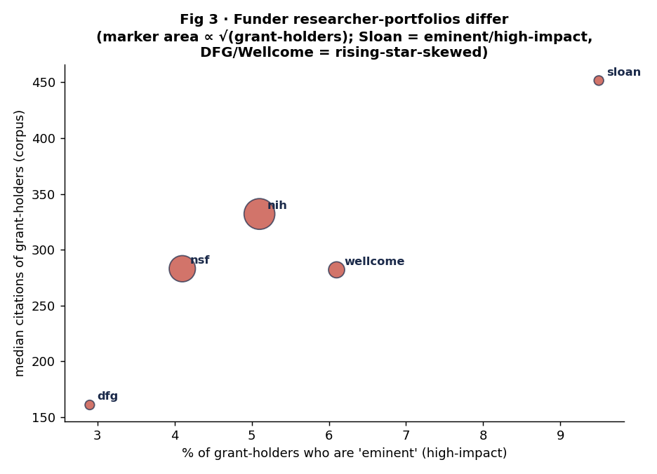
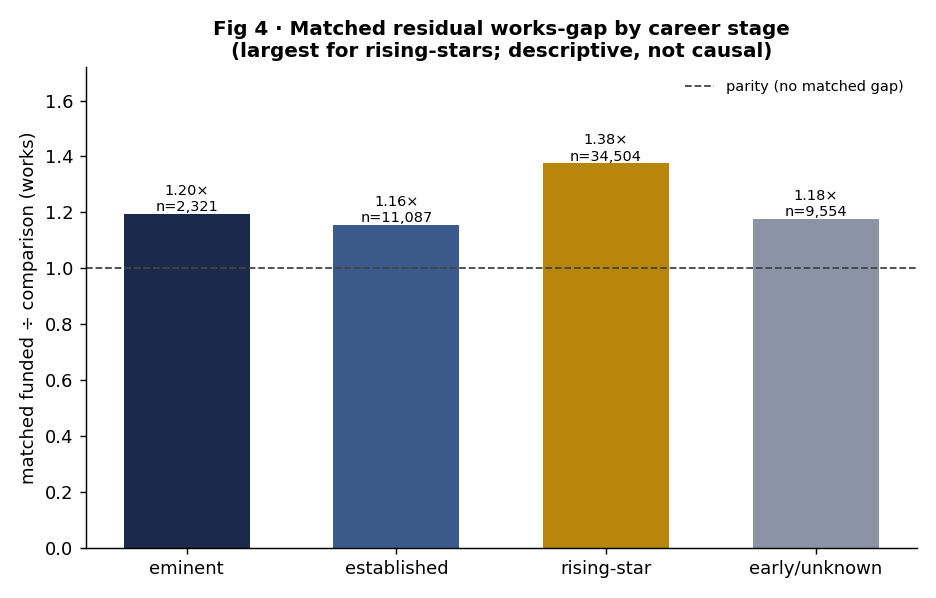

# Public funding and researcher careers: funder portfolios, career-stage composition, and why the funded-vs-unfunded productivity gap is mostly selection, not effect

**Author:** Bucket Foundation · research-atlas working group
**Version:** 1.0 (preprint draft) · **Date:** 2026-06-24
**Corpus:** research-atlas v0.1.0 (2026-06-24 build) — 1,740,326 grant-PI edges; a new `grant_pi_person` bridge resolving 528,570 of them (30.4%) to 59,180 canonical OpenAlex-author researchers
**DOI:** [10.5281/zenodo.20774322](https://doi.org/10.5281/zenodo.20774322) (concept; this study = research-atlas v0.5.0 = 10.5281/zenodo.20836727)
**Reproducibility:** every number in this paper is emitted by `analysis/careers/run.py` into `analysis/careers/results.json` and pinned by `tests/test_funding_careers.py`, which re-derives each constant from the live DuckDB (and from a seeded bootstrap) and fails if the prose and the data diverge. `results.json` is the authoritative source for every statistic quoted below.

---

## Abstract

Papers 01–03 in this series studied the funding graph without ever touching the
people side: a grant's principal investigator (PI) was a name-only node with no
ORCID, a *different node set* from the canonical OpenAlex-author researcher layer,
so funding could not be joined to careers at all. A new conservative resolver
(`atlas/users/pi_resolve.py`) closes that gap, producing a `grant_pi_person`
bridge that links **528,570** of the 1,740,326 PI edges (**30.4%**) to **59,180**
distinct canonical researchers (**490,839** edges carry an ORCID). This paper asks
how public funding maps onto researcher careers — and its **central
methodological move is to refuse a tempting false claim**. The resolver succeeds
**precisely** on ORCID-era, OpenAlex-indexed, more-productive researchers: the
resolved "funded" population is **89.9% ORCID'd vs 69.1%** for the canonical
researcher pool it is drawn from (a **+20.8pp** gap), with **2.12×** the mean
publications. So a naive "funded researchers publish 2× more" is **confounded by
resolution/selection bias, not a funding effect**, and we state that up front and
quantify it. We then make three descriptive claims that survive the bias.
**(1) Who each funder funds.** Funder researcher-portfolios differ in shape:
Sloan funds the most eminence-skewed, highest-impact portfolio (**9.5%** of its
grant-holders are high-impact "eminent", median **451.5** citations), while DFG
and Wellcome are the most early-career-skewed (DFG **69.0%** rising-stars); NIH's
grant-holders are **88.0%** biomedical, NSF's span the disciplines with no field
above **28%**. These are *within-funder* structures that do not reference the
unfunded baseline. **(2) Career-stage composition of grant-holders.** Across the
funded population, **58.8%** are rising-stars, **19.2%** established, **4.6%**
eminent; grant-holding is concentrated (median 4 grants/researcher, max 394; 6.55%
hold grants from ≥2 distinct funders). **(3) Funded vs comparison, done
honestly.** Restricting to the *resolvable* population (researchers at the same
1,574 grant-receiving ROR-resolved organizations who **could** have been matched)
and **matching on field × career-stage × entry-era**, the naive within-population
ratio of **2.11×** collapses to a matched residual of **1.23× works (95% CI
[1.18, 1.28])**, **1.23× h-index**, and only **1.06× citations** — i.e. *roughly
80% of the apparent gap is selection*. We make **no causal claim**: the matched
residual is descriptive structure of the funded population, not a return to
funding. The selection-bias treatment is itself the contribution.

---

## 1. Introduction

The first three papers on the research-atlas graph all lived on the *institution
and output* side of the funding economy. Paper 01 measured how unequally grants
are distributed across institutions and how much published output accompanies a
funder's grants. Paper 02 left the funding graph entirely to study
paper-recommendation methods on the citation graph. Paper 03 asked what each
funder funds, by field, using grant→work→topic links. None of them could touch
the question a science-policy reader asks as soon as they hear the word "PI":
**how does public funding map onto the careers of the people who receive it?**

The reason is a data gap that paper 03 diagnosed and named. The PI of a grant
arrives in the atlas as a *name only* — sourced from the NIH/NSF/Wellcome/DFG/
Sloan award feeds — with no ORCID and no link to publications. The canonical
"researchers" layer of the atlas is a *different node set*, built from OpenAlex
work-authors, and *those* nodes carry ORCID, ROR-resolved affiliations, field
profiles, and per-researcher productivity proxies (works, citations, an h-index
proxy, a career-stage label). The two never joined, so a grant's PI could never
be connected to the researcher who actually published. There was no funding↔career
edge in the graph.

This paper is built on the new bridge that supplies that edge. A conservative,
tiered resolver (`atlas/users/pi_resolve.py`, in the exact discipline as the ROR
organization matcher) matches a PI to a canonical researcher only when they share
a ROR-resolved recipient organization **and** a surname **and** a compatible given
name, with a unique winner; everything ambiguous resolves to *no link* rather than
a wrong one. The result links 30.4% of PI edges to 59,180 researchers.

That 30.4% is not a nuisance to be footnoted — **it is the methodological heart of
the paper.** The resolver does not fail at random. It succeeds *exactly* where the
researcher is ORCID-era, OpenAlex-indexed, and at a well-identified institution —
which is *exactly* the profile of a more visible, more productive researcher.
Joining the two halves of the funding graph therefore introduces a powerful
positive selection, and any comparison that ignores it will mistake that selection
for an effect of funding. The contribution of this paper is to map funding onto
careers **while handling that selection honestly**, by (a) measuring the bias
directly, (b) restricting every comparison to the population that *could* have been
matched and then matching on the obvious confounds, and (c) leaning on
within-funder structure that does not depend on the unfunded baseline at all. We
make no causal claims about returns to funding; every finding is the *descriptive
structure of the funded population*.

---

## 2. Data and methods

### 2.1 The bridge and the resolvable population

The `grant_pi_person` bridge (one row per resolved PI edge) carries
`person_atlas_id` (the canonical researcher), `orcid` (when the matched candidate
has one), `match_method`, `match_score`, `recipient_ror`, `field_slug`, and the
funder `source`. It resolves **528,570** of **1,740,326** PI edges (**30.37%**;
490,839 with ORCID) onto **59,180** distinct researchers across **1,574**
ROR-resolved recipient organizations. Two match tiers fire: `name+org`
(478,612 edges) and `name+org+field` (49,958 edges); the ORCID tier is dormant
because the PI feeds rarely carry ORCID today.

The canonical researcher attributes — `seniority` (a career-stage proxy:
`eminent` / `established` / `rising-star` / `early-or-unknown`), `field_slug`,
`works_count`, `total_citations`, `h_index_proxy`, `first_year` — are produced by
`atlas/users/segment.py` over the atlas corpus. They are **proxies, bounded by the
corpus window, biased to under-claim** (an established researcher whose early
career predates the corpus reads as a shorter span); this is the honest direction
and we treat them as ordinal descriptors, not ground truth.

### 2.2 The selection bias, stated first and quantified

Before any comparison we measure the bias. The resolved (funded) researchers are
not a random sample of the canonical researcher pool: they are **89.9% ORCID'd vs
69.1%** for the pool (a **+20.8pp** gap), with mean publications **5.12 vs 2.41**
(**2.12×**) and mean citations **826 vs 386** (**2.14×**). *This gap is the
confound, not a finding.* It is produced jointly by (i) the resolver succeeding on
the more-visible researchers and (ii) the canonical layer itself over-representing
OpenAlex-indexed, ORCID-era authors. Any analysis that compares "funded" to "all
researchers" is measuring this selection. We therefore never do that comparison as
a headline; we report it only to expose the confound (Figure 1A).



*Figure 1. (A) The selection, not an effect: resolved/funded PIs are far more
ORCID'd and more productive than the canonical researcher pool they are drawn
from — this is the confound, not a finding. (B) Restricting to the resolvable
population and matching on field × career-stage × entry-era collapses the naive
2.1× publication gap to a matched residual of ~1.2× (works, h-index) and ~1.06×
(citations); error bars are 2,000-sample bootstrap 95% CIs.*

### 2.3 The three honest strategies

**Strategy A — within-funder structure (no baseline).** The composition of each
funder's grant-holders by career stage, field, and productivity (§3.1) references
only the funded population. The resolution bias inflates *all* funders' portfolios
alike, so the *relative* shape across funders — Sloan vs DFG vs NIH — is robust to
it. This is the cleanest view and we lead with it.

**Strategy B — descriptive composition of grant-holders (no baseline).** The
career-stage mix of the whole funded population and the concentration of
grant-holding (§3.2) are pure descriptions of who holds grants; no unfunded
comparison enters.

**Strategy C — restricted + matched comparison.** Only in §3.3 do we compare
funded to unfunded, and we do it the only honest way. We restrict to the
**resolvable population**: every canonical researcher whose primary organization is
one of the 1,574 grant-receiving ROR-resolved orgs — i.e. someone who *could* have
been matched to a grant at a funded institution (565,867 researchers: 59,180 funded
+ 506,687 comparison). We then **match on field × career-stage × 5-year entry-era**,
keeping only strata with ≥30 people in **both** groups (193 strata covering 57,466
funded researchers), compute the within-stratum funded and comparison means, and
combine them with funded-count weights (a funded-population-standardized contrast).
A **2,000-sample stratum bootstrap** (seed 42) gives the CI. The matched residual
is reported as **descriptive structure of the funded population**, explicitly *not*
a causal return to funding — too many unobserved confounds (talent, mentorship,
prior productivity that itself drove the award) remain inside each stratum.

### 2.4 Robustness discipline (counts and proxies, never dollars)

Every statistic here is a distinct-person count or a per-researcher productivity
proxy. **No dollar column is used anywhere**, so the recipient fuzzy-match and
shared-grant double-counting noise documented in `docs/GRAPH.md §2.5` cannot reach
any number in this paper. All queries are read-only and live in
`analysis/careers/funding_careers.py`.

---

## 3. Results

### 3.1 Who each funder funds: distinct researcher-portfolios

Mapping each funder's resolved grant-holders to career stage and field recovers
materially different *researcher-portfolios* — and because this is within-funder
structure, the resolution bias (which inflates every funder alike) does not
distort the relative picture.

**Career-stage shape differs (Figure 2).** Sloan funds the most
**eminence-skewed** portfolio: **9.5%** of its grant-holders are high-impact
"eminent" — roughly double NIH's 5.1% and NSF's 4.1% — and the *least*
early-career (12.5% early/unknown). At the other end, **DFG (69.0%) and Wellcome
(63.0%)** are the most **rising-star-skewed**, with the thinnest eminent tails
(DFG 2.9%). NIH and NSF sit in between with near-identical stage mixes (~57–59%
rising-stars, ~19–21% established). The reading is intuitive: a small
fellowship-style private funder (Sloan) concentrates on already-distinguished
investigators, while a national basic-research agency (DFG) and a biomedical
charity (Wellcome) fund a younger cohort.



*Figure 2. Who each funder funds, by career stage: the career-stage composition
of each funder's distinct resolved grant-holders. Sloan is the most
eminence-skewed; DFG and Wellcome the most rising-star-skewed. Within-funder
structure — the resolution bias inflates every funder alike, so the relative
shape is robust.*

**Field shape differs sharply.** NIH's grant-holders are **88.0% biomedical**
(with thin tails in econ-social 3.7%, engineering 2.5%); Wellcome is similarly
biomedical (87.7%). NSF is the disciplinary generalist — its single largest
researcher field is biomed-bio at only **28.0%**, followed by earth-climate
(22.0%), engineering (13.5%) and CS/ML (10.7%). This recovers, from the *people*
side, the same agency division of labor paper 03 found on the *output* side.

**Productivity differs in level but tracks portfolio shape (Figure 3).** Median
grant-holder citations run from Sloan **451.5** (its eminence skew) and NIH 332
down to DFG **161** (its rising-star skew). Plotting eminence share against median
citations places the five funders in a clean, interpretable spread — Sloan in the
high-eminence/high-impact corner, DFG in the low/low corner — with NIH the
high-volume centroid.



*Figure 3. Funder researcher-portfolios differ on eminence (% of grant-holders
who are high-impact) versus median grant-holder citations; marker area ∝
√(number of grant-holders). Sloan occupies the high-eminence/high-impact corner,
DFG the low/low corner, NIH the high-volume centroid.*

### 3.2 Career-stage composition and concentration of grant-holders

Across the whole funded population (59,180 researchers), grant-holders are
**58.8% rising-stars, 19.2% established, 17.4% early/unknown, and 4.6% eminent**.
That the modal grant-holder reads as a rising-star is partly the corpus-window
proxy (career span is truncated) and partly real — the resolver's `name+org`
discipline favors researchers with an identifiable recent institutional
affiliation. We report the composition descriptively, not as a claim about the
true age structure of PIs.

Grant-holding is **concentrated**: the median resolved researcher holds **4
distinct grants**, the mean is **8.9**, and the maximum is **394**; **15,947**
researchers hold ≥10 grants while **11,532** hold exactly one. Cross-funder
holding is rare: only **6.55%** of resolved researchers are linked to grants from
≥2 distinct funders (3,837 from two, 40 from three) — consistent with the
single-country, single-agency structure of most careers in the corpus.

### 3.3 Funded vs comparison: the gap is mostly selection

Now the comparison that demands the most care. Within the **resolvable
population** (researchers at the 1,574 funded organizations), the *naive*
funded-vs-comparison ratio is **2.11× works** — almost identical to the
funded-vs-*all* ratio (2.12×), confirming that restricting to funded orgs alone
removes little of the bias.

**Matching on field × career-stage × entry-era collapses it (Figure 1B).** Across
the 193 matched strata, the funded-population-standardized residual is:

- **works: 1.227× (95% CI [1.183, 1.281])**
- **h-index proxy: 1.234× (95% CI [1.197, 1.283])**
- **citations: 1.057× (95% CI [1.027, 1.098])**

So **roughly 80% of the apparent 2.1× publication gap is selection** — the same
field, the same career stage, and the same entry era account for most of it. The
matched citation ratio is barely above parity (1.06×): the large raw citation
advantage of funded researchers is *almost entirely* a composition effect (funded
researchers are concentrated in more-cited fields and stages). The residual
works/h gaps clear parity (their CIs exclude 1.0) but fall **far** below the naive
ratio (their CIs exclude 2.0), which is exactly what an honest analysis should
find: a small descriptive residual, not a doubling.

**The residual is largest for rising-stars (Figure 4).** Broken out by career
stage with the same matching discipline, the matched works ratio is **1.375× for
rising-stars** (n=34,504), versus **1.156×** established, **1.195×** eminent, and
**1.178×** early/unknown. We resist the causal reading (that funding "boosts"
early-career output most); the more conservative interpretation is that among
early-career researchers at a funded org, *being identifiable as a funded PI* is
itself most correlated with the productivity that the resolver and the seniority
proxy both key on. This is descriptive structure, flagged as such.



*Figure 4. Matched residual works-gap by career stage (same field × entry-era
matching within each seniority). The residual is largest for rising-stars
(1.38×) and smallest for established researchers (1.16×); the dashed line is
parity. Descriptive, not causal.*

---

## 4. Discussion

**The headline is a refusal.** The most clickable sentence available from this
bridge — "funded researchers publish twice as much" — is false as a statement
about funding, and the paper's main job is to show *why* and *by how much* it is
false. The 2.1× raw gap is produced by a resolver that succeeds on the
ORCID-era, well-affiliated, more-productive researchers, layered on a canonical
researcher pool that already over-represents them. Once field, career stage, and
entry era are held fixed within the funded-org population, ~80% of the gap is gone
and the citation advantage all but vanishes. The selection-bias treatment is the
contribution: it is a worked example of how a partial entity-resolution join can
manufacture an effect-shaped artifact, and how to dissolve it.

**What does survive is structural, not causal.** The funder researcher-portfolios
(§3.1) are robust because they are within-funder: Sloan really does fund a
different *kind* of researcher (eminent, high-impact) than DFG or Wellcome (early
career), and NIH really does fund a different *field* mix than NSF. These shapes
need no unfunded baseline and are not touched by the resolution bias, which scales
every funder's portfolio alike. They are the trustworthy findings.

**A bridge to the rest of the series.** Paper 01 found institutional concentration;
this paper finds that *grant-holding* is concentrated at the person level too
(median 4 grants, a long tail to 394). Paper 03 found a stable field division of
labor among funders on the output side; this paper recovers the same division on
the people side (NIH biomedical, NSF broad) — independent corroboration of the
reconciliation, now through a second, people-keyed join.

**Why descriptive structure is still useful.** A funder that wants to know whether
it funds a younger or more-established cohort than its peers, or whether its
grant-holders cluster in one field or span many, gets a direct, baseline-free
answer here. What it does *not* get — and should not infer — is a causal estimate
of what its money does to a career. That requires a design this observational
graph cannot supply (no pre/post, no rejected-applicant counterfactual), and we
say so plainly.

---

## 5. Limitations

We state these plainly; none is hidden.

1. **Resolution is 30.4% and positively selected (the central caveat).** The
   funded population is not all PIs; it is the ORCID-era, OpenAlex-indexed,
   well-affiliated PIs the conservative resolver can match. Every result is scoped
   to *that* population, and the §3.3 comparison is restricted+matched precisely
   because of this. The selection is measured (§2.2, Figure 1A), not assumed away.
2. **No causal claim.** The matched residual (§3.3) is descriptive structure, not
   a return to funding. Unobserved confounds — talent, mentorship, prior
   productivity that drove the award itself — remain inside every stratum, and
   there is no rejected-applicant counterfactual in the graph. The honest
   interpretation is "funded researchers, matched on the obvious confounds, are
   modestly more productive in this corpus", with the modesty doing the work.
3. **Career stage / productivity are corpus-bounded proxies.** Seniority is a
   proxy over the atlas window (`atlas/users/segment.py`), biased to under-claim;
   the rising-star modal class partly reflects truncated career spans. We treat
   the labels as ordinal descriptors.
4. **Funder coverage is uneven.** Five funders clear the 300-resolved-PI floor
   (NIH 38,962; NSF 20,518; Wellcome 2,901; Sloan 368; DFG 348). NIH dominates the
   resolved population, so the *whole-population* composites (§3.2) are
   NIH-weighted; the per-funder portfolios (§3.1) are the de-weighted view.
5. **The comparison cohort is "unmatched-at-a-funded-org", not "unfunded".** A
   comparison researcher may hold a grant whose PI edge simply did not resolve, or
   a grant from a funder not in the corpus. The label is "not in the bridge", which
   is weaker than "never funded"; this *attenuates* the funded/comparison contrast
   (it puts some truly-funded people in the comparison arm), making the small
   matched residual a conservative read.

---

## 6. Reproducibility statement

Every number in this paper is computed by `analysis/careers/run.py` directly from
`research_atlas.duckdb` and written to `analysis/careers/results.json`; the
figures are rendered by the same script into `analysis/careers/figures/`. The
matched bootstrap is seeded (seed 42), so the CIs are exactly reproducible. The
constants quoted in the text are pinned by `tests/test_funding_careers.py`, which
re-derives them from the live database and fails if the prose and the data
diverge. To reproduce from the published graph:

```bash
pip install -e .                              # duckdb, pandas, numpy, matplotlib
python scripts/resolve_pis.py                 # (re)build the grant_pi_person bridge
python scripts/build_db.py                    # load the bridge into DuckDB
python analysis/careers/run.py                # results.json + figures (idempotent)
python -m pytest tests/test_funding_careers.py -q
```

**Data availability.** The graph is published as parquet under `data/processed/`
(manifest: `data/MANIFEST.json`), license CC-BY-4.0 (data) / MIT (code). The
`grant_pi_person` bridge carries no PII (it is a key→key edge table with ORCIDs,
which are public identifiers). The email-bearing researcher table is **local and
gitignored**; only schema, counts, and an email-free aggregate
(`analysis/pi_resolution.json`) are committed. Sources: NIH RePORTER, NSF Awards,
Wellcome (360Giving), DFG, Sloan, OpenAlex, ROR, ORCID.

**Author contributions / COI.** research-atlas is developed under the Bucket
Foundation open-data program. No competing financial interests.

---

## Appendix A. Headline numbers (machine-checked)

| Quantity | Value | Source field in `results.json` |
|---|---:|---|
| PI edges | 1,740,326 | `coverage.pi_edges` |
| Resolved PI edges | 528,570 (30.37%) | `coverage.resolved_edges` |
| Distinct resolved researchers | 59,180 | `coverage.distinct_resolved_researchers` |
| Funded-org pool (recipient RORs) | 1,574 | `coverage.distinct_recipient_orgs` |
| Funded % ORCID vs all | 89.9% vs 69.1% (+20.8pp) | `resolution_bias.*.pct_orcid` |
| Naive works ratio (funded/all) | 2.124× | `resolution_bias.naive_works_ratio_funded_over_all` |
| Resolvable population | 565,867 (59,180 + 506,687) | `matched_productivity.n_*` |
| Matched strata | 193 | `matched_productivity.n_strata` |
| Naive works ratio (within resolvable) | 2.111× | `matched_productivity.naive_works_ratio_within_resolvable` |
| **Matched works ratio** | **1.227× [1.183, 1.281]** | `matched_productivity.matched_works_ratio` |
| Matched h-index ratio | 1.234× [1.197, 1.283] | `matched_productivity.matched_h_ratio` |
| Matched citations ratio | 1.057× [1.027, 1.098] | `matched_productivity.matched_citations_ratio` |
| Matched works ratio, rising-stars | 1.375× | `matched_by_stage.rising-star.matched_works_ratio` |
| Grant-holder stage mix | 58.8% RS / 19.2% est / 4.6% emin | `stage_composition.share_pct` |
| Median grants per researcher | 4 (mean 8.9, max 394) | `portfolio_concentration.*` |
| Multi-funder share | 6.55% | `portfolio_concentration.multi_funder_share_pct` |
| Sloan eminent share / median citations | 9.5% / 451.5 | `funder_portfolios` (sloan) |
| DFG rising-star share | 69.0% | `funder_portfolios` (dfg) |
| NIH biomed share / NSF top-field share | 88.0% / 28.0% | `funder_portfolios` |
